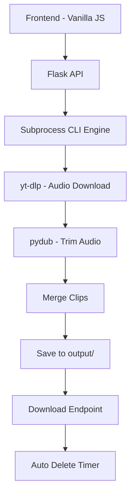
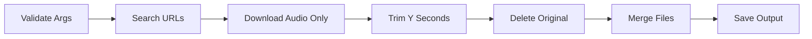
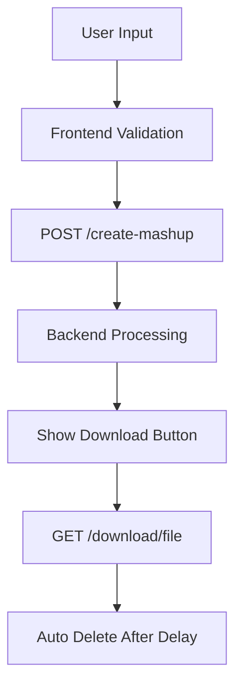
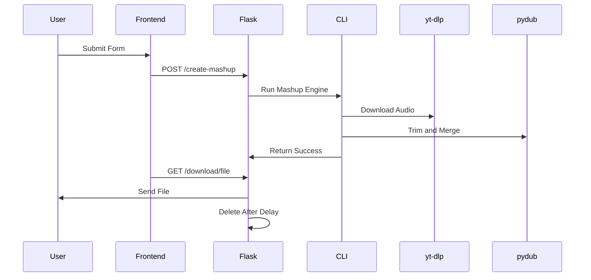

# Mashup Generator

A full-stack web application that generates a custom audio mashup from YouTube songs based on user input.

This project started as a command-line utility and evolved into a complete web application with a Flask backend, Vanilla JavaScript frontend, and Render deployment.

---

## Project Overview

The Mashup Generator:

- Searches YouTube for songs by a given singer
- Downloads audio-only streams
- Trims the first *Y* seconds from each song
- Merges all trimmed clips into a single mashup file
- Allows users to download the generated file
- Automatically deletes generated files after a short duration

The system is environment-aware and works both locally and on Render.

---

## Architecture Overview



---

## Phase 1: CLI Engine

The project began as a command-line program.

### CLI Usage

```bash
python 102303592.py "Singer Name" <NumberOfVideos> <Duration> <OutputFileName>
```

Example:

```bash
python 102303592.py "Arijit Singh" 12 30 mashup.mp3
```

### CLI Responsibilities

- Validate arguments
- Create required directories
- Search YouTube using yt-dlp
- Download audio-only streams
- Trim first Y seconds using pydub
- Merge all clips
- Save output file
- Clean temporary files

### CLI Flow



---

## Phase 2: Flask Backend

The CLI engine was wrapped inside a Flask application.

### API Endpoints

#### Create Mashup

```
POST /create-mashup
```

**Body (JSON):**

```json
{
  "singer": "Arijit Singh",
  "number_of_videos": 12,
  "duration": 30,
  "output_file": "api_test.mp3"
}
```

#### Download File

```
GET /download/<filename>
```

After the first download, the file is automatically deleted after a configurable delay.

---

## Phase 3: Frontend (Vanilla JavaScript)

A clean and minimal UI was built using:

- HTML
- CSS
- Vanilla JavaScript
- Fetch API

### Features

- Frontend validation (same rules as backend)
- Loading state while mashup is being generated
- 60-second download countdown
- Download button disabled after first click
- Automatic file expiration message

### Frontend Flow



---

## Environment Configuration

The application uses environment variables for configuration.

### `.env` (Local Only - Not Committed)

```
APP_ENV=local
FFMPEG_PATH=D:\ffmpeg\bin
DELETE_DELAY=20
BASE_URL=http://127.0.0.1:5000
```

### `.sample.env` (Template)

Provided in the repository for reference.

---

## Local Setup Instructions

### 1. Clone Repository

```bash
git clone https://github.com/<your-username>/Mashup.git
cd Mashup
```

### 2. Create Virtual Environment

```bash
python -m venv .env
.env\Scripts\activate  # Windows
```

### 3. Install Dependencies

```bash
pip install -r requirements.txt
```

### 4. Setup `.env`

Copy:

```bash
copy .sample.env .env
```

Edit values as needed.

### 5. Run Locally

```bash
python web_app.py
```

Open:

```
http://127.0.0.1:5000
```

---

## Deployment on Render

### 1. Push Code to GitHub

```bash
git add .
git commit -m "Render deployment ready"
git push
```

### 2. Create New Web Service on Render

- Environment: Python
- Build Command:

```
pip install -r requirements.txt
```

- Start Command:

```
gunicorn web_app:app
```

### 3. Add Environment Variables in Render Dashboard

```
APP_ENV=render
DELETE_DELAY=20
```

Do not set FFMPEG_PATH for Render.

### 4. Deploy

Render provides a public URL:

```
https://your-app-name.onrender.com
```

---

## Production Flow



---

## Key Design Decisions

- Audio-only download to reduce bandwidth
- Immediate deletion of intermediate files
- Environment-aware configuration
- Frontend and backend validations aligned
- Auto file expiration to prevent storage issues
- Clean separation between CLI engine and web layer

---

## Tech Stack

Backend:
- Flask
- yt-dlp
- pydub
- gunicorn

Frontend:
- HTML
- CSS
- Vanilla JavaScript

Deployment:
- Render

---

## Future Improvements

- Background task queue (Celery or RQ)
- Progress bar with live updates
- User authentication
- Caching
- File size optimization
- Async processing

---

## Conclusion

This project demonstrates:

- CLI application design
- REST API development
- Frontend integration
- File processing pipelines
- Environment-based configuration
- Production deployment

It evolved from a simple script to a deployable full-stack application.

